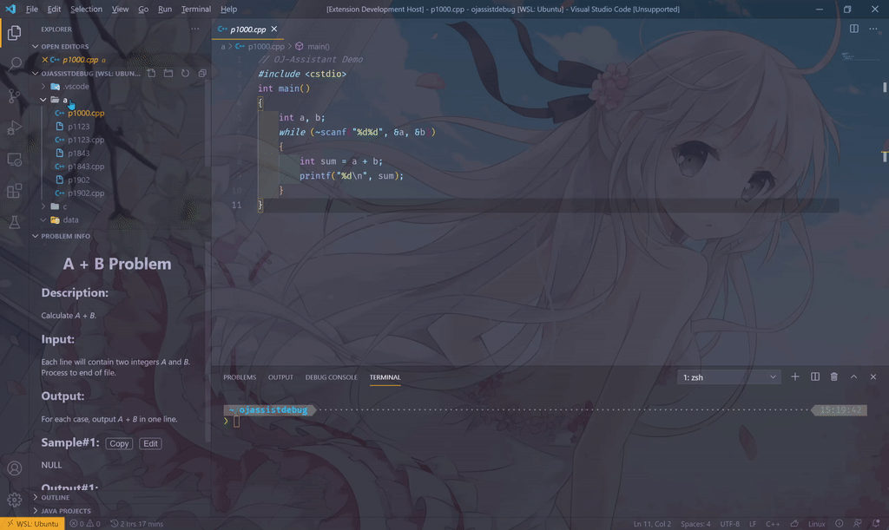
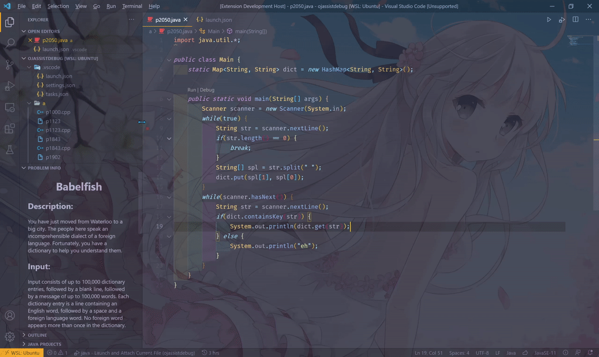

# OJ-Assistant

谁不想要一个舒适的编程环境呢？

## 特性

### 查看题目

在配置文件中设置好正确的路径解析格式，当你打开一道题目时， VSCode 的左下方会显示题目的描述、样例和备注。    
* 点击样例右方的 `Copy` 按钮，可以将样例输入复制到剪贴板。
* 点击样例右方的 `Edit` 按钮，可以直接打开测试输入文件。  

### 测试输入

提供 `ojassist.dataFile` 命令，搭配 VSCode 的调试功能可以自动输入数据。  

  

### 快速交题

1. 按下 `F1` 或 `Ctrl+Shift+P`, 输入 `submit` 查找 `OJ-Assist: Submit this code` 命令， 回车即可自动将代码提交到 OJ。
2. 右下方将会提示代码的提交进度，以及评测结果。  

## 安装及使用

当前版本的 OJ-Assistant 需要一些配置才能正常使用，  
请移步至[这里](https://github.com/lss233/oj-assistant/wiki/getting-started)。

# TODOs
- [] 代码通过时播放提示音
- [] 比赛计时
- [] 支持更多 OJ

# Issues & Contribution

This project is under heavy development, every help will be appreciated.

# License
This project is licensed under [MIT License](LICENSE).